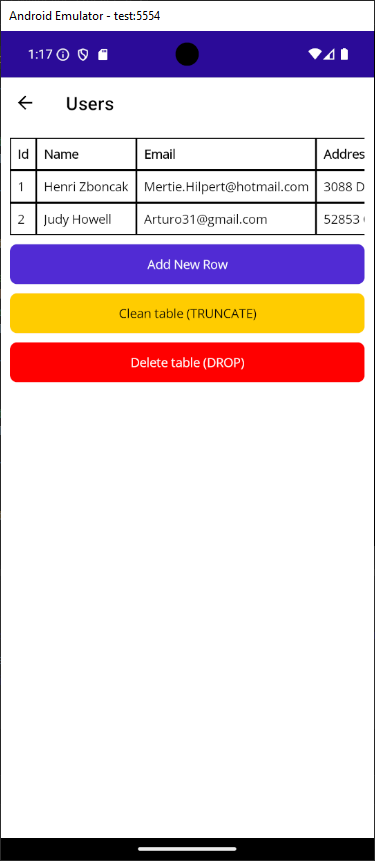

# SQLiteBrowser

SQLiteBrowser is a NuGet package designed for .NET MAUI applications. It provides a user-friendly interface for viewing and managing SQLite databases. With just a few lines of code, you can navigate your database, view tables, inspect columns and data, and perform CRUD operations (Create, Read, Update, Delete) on rows.

## Features

- **Table Explorer**: View all tables in your SQLite database.
- **Data Management**: Add, edit, and delete rows directly within the app.
- **Ease of Integration**: Quickly integrate with your .NET MAUI application.

## Installation

To use SQLiteBrowser, install it via NuGet:

```sh
dotnet add package SQLiteBrowser
```

Or search for SQLiteBrowser in the NuGet Package Manager in Visual Studio.

## Getting started

Here’s how to integrate SQLiteBrowser into your .NET MAUI application:

1. **Import the Namespace**: Add the following using statement to your class:

```cs
using SQLiteBrowser;
```

2. **Add navigation**: Navigate to the DatabaseBrowserPage, passing the path to your SQLite database:

```cs
await Navigation.PushAsync(new DatabaseBrowserPage("path/to/database.sqlite"));
```

Replace `path/to/database.sqlite` with the actual path to your SQLite database file.

3. **View and Manage Your Data**

- The DatabaseBrowserPage displays all tables in the SQLite database.

- Clicking on a table shows the table’s columns and data.

- You can:

  - **Add** rows by using the provided interface.
  - **Edit** rows by clicking on a specific row and modifying its values.
  - **Delete** rows by selecting a row and choosing the delete option.

## Example

Here’s a minimal example of using SQLiteBrowser in a .NET MAUI application:

```cs
using Microsoft.Maui.Controls;
using SQLiteBrowser;

namespace MyApp;

public partial class MainPage : ContentPage
{
    public MainPage()
    {
        InitializeComponent();
    }

    private async void OpenDatabaseBrowser(object sender, EventArgs e)
    {
        await Navigation.PushAsync(new DatabaseBrowserPage("my_database.sqlite"));
    }
}
```

In the XAML file, you can add a button to trigger the `OpenDatabaseBrowser` method:

```xml
<Button Text="Open Database Browser" Clicked="OpenDatabaseBrowser" />
```

## Screenshots

Table list:


Table details:


Edit/add row:


## Requirements

- .NET MAUI project
- SQLite database file (e.g., `.sqlite` or `.db`) with a known path

## Contributing

Contributions are welcome! To contribute:

1. Fork the repository
2. Create a feature branch
3. Submit a pull request with your changes

Also feel free to open an issue for any bugs/missing features.

## License

SQLiteBrowser is licensed under the MIT License.
